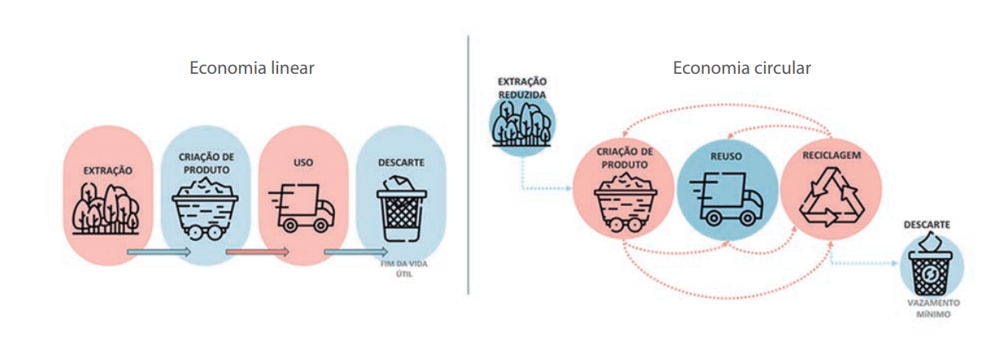
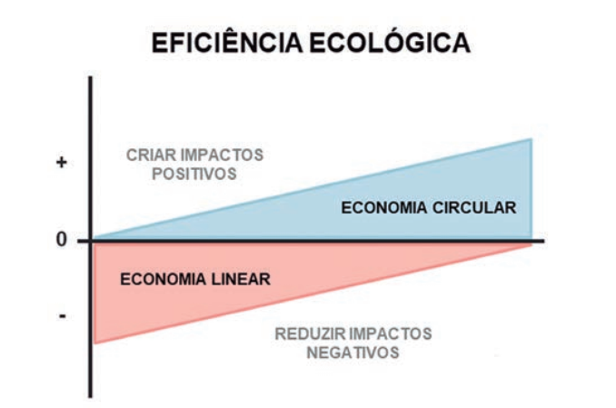
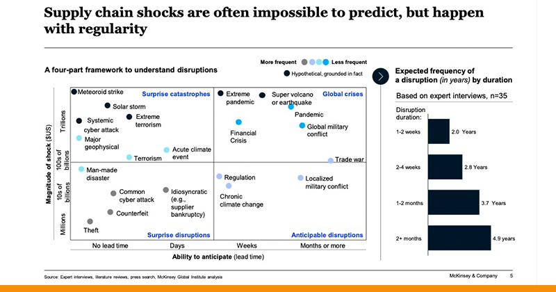
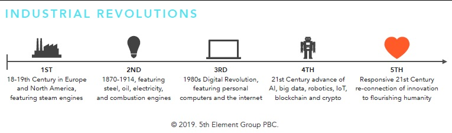

```{r child = "setup.Rmd"}
```

```{r xaringan-tile-view, echo=FALSE}
xaringanExtra::use_tile_view()
```

```{r xaringan-editable, echo=FALSE}
xaringanExtra::use_editable(expires = 1)
```

```{r xaringan-panelset, echo=FALSE, message=FALSE, warning=FALSE}
xaringanExtra::use_panelset()
xaringanExtra::style_panelset_tabs(panel_tab_font_family = "sans-serif")
```

```{r xaringanExtra-clipboard, echo=FALSE}
htmltools::tagList(
  xaringanExtra::use_clipboard(
    button_text = "<i class=\"fa fa-clipboard\"></i>",
    success_text = "<i class=\"fa fa-check\" style=\"color: #90BE6D\"></i>",
    error_text = "<i class=\"fa fa-times-circle\" style=\"color: #F94144\"></i>"
  ),
  rmarkdown::html_dependency_font_awesome()
)
```

```{r xaringan-fit-screen, echo=FALSE}
xaringanExtra::use_fit_screen()
```

```{r xaringan-extra-styles, echo=FALSE}
xaringanExtra::use_extra_styles(
  hover_code_line = TRUE,         #<<
  mute_unhighlighted_code = TRUE  #<<
)
```

```{css include=FALSE}
.panelset {
   --panel-tab-foreground: currentColor;
   --panel-tab-background: unset;
   --panel-tab-active-foreground: currentColor;
   --panel-tab-active-background: unset;
   --panel-tab-active-border-color: currentColor;
   --panel-tab-hover-foreground: currentColor;
   --panel-tab-hover-background: unset;
   --panel-tab-hover-border-color: currentColor;
   --panel-tab-inactive-opacity: 0.5;
   --panel-tabs-border-bottom: #ddd;
   --panel-tab-font-family: Sen;
   --panel-tab-background-color-active: #fffbe0;
   --panel-tab-border-color-active: #023d4d;
}

.panelset .panel-tabs .panel-tab > a {
	color: #023d4d;
}

.panelset .panel-tabs {
  font-size: 0.5rem;
}
```

class: center, middle

## Retrospecto

---

# Definições

### Logística

.midi[
.question[
“**Logística** é dispor a **mercadoria ou o serviço** certo, no **lugar** certo, no **tempo** certo e nas **condições desejadas**, ao mesmo tempo em que fornece a **maior contribuição à empresa**”. 
(Ballou, 2001)
]
]

### Gestão Cadeia de Suprimentos

.question[
.midi[
**Cadeia de suprimentos** é a estrutura consolidada e integrada, em níveis estratégico, tático e operacional, entre agentes de produção, mercadológicos, logísticos e sociedade, para que seja possível coordenar as operações de maneira a garantir a gestão orientada à logística, tendo como objetivo o _trade-off_ entre **responsividade** e **eficiência**, além de garantia de um contexto sustentável de desenvolvimento por ações **socialmente responsáveis** e **resilientes.** 
]
]

---


# Fatores-chave de desempenho

- **Instalações**   
- **Estoques**   
- **Transportes**     
- **Informação**   

---
class: middle

# Redes Logísticas

---

# Omnichannel

.question[
Omnichannel é uma estratégia de **uso simultâneo e interligado** de **diferentes canais de comunicação**, com o objetivo de estreitar a relação entre online e offline, aprimorando, assim, a **experiência do cliente**. Essa tendência do varejo permite a **convergência do virtual e do físico**.
]

.center[
.larger[
INTERNET FÍSICA
]]

---

# Sustentabilidade e cadeia de suprimentos

- Recursos cada vez mais escassos
- Índices de poluição elevados
- Desmatamentos incontroláveis
- Vasta extensão de lixo 
- Impactos sociais
- Impactos econômicos

.question[
Ao unificar as pontas da **cadeia de geração e consumo de bens**, a **economia circular** tem a capacidade de revolucionar toda a economia, com impactos positivos para o meio ambiente e a sociedade como um todo. 
]

---

# Economia circular e cadeia de suprimentos

.question[
- **Iniciativas sustentáveis e verdes em supply chain**    
    - Minimizar os impactos negativos da produção e do consumo
    - Redução de desperdício e de poluição. 
  
- **Economia circular** 
  - Contínua transformação de produtos, sem desperdício, sem resíduo e com fontes de energia 100% verdes. 
]

---

# Economia linear x Economia circular

.question[
A **transformação digital e tecnológica** tende a **viabilizar soluções inovadoras** na criação e gestão de economias circulares, gerando um **contexto econômico, social e ambiental disruptivo**.
]

```{r echo=FALSE, message=FALSE, warning=FALSE, out.width="150%"}

```

---

# Economia circular

.pull-left[
Novas estratégias que **estreitam**, **desaceleram**, **intensificam** e **fecham os loops** da cadeia de suprimentos.

Essas novas estratégias geram não somente mudanças em diferentes etapas de processos de logística e supply chain, mas também **novos desenhos de negócios totalmente disruptivos**.
]

.pull-right[
```{r echo=FALSE, message=FALSE, warning=FALSE, out.width="100%"}

```
]

---

# Economia circular

### 1. Limitar o ciclo 

**Melhorar a eficiência dos processos de produção, distribuição e consumo.**
- Shampoo em barra: dispensam embalagens plásticas.
- Sabão em pós-concentrado: aumenta a relação de produto/embalagem.

### 2. Reduzir a velocidade
**Reduzir a velocidade de descarte é prolongar a vida útil dos produtos.**

- A empresa Cambridge Crops que desenvolveu uma película natural, comestível e protetora que mantém os alimentos frescos por mais tempo, reduzindo o desperdício por perda de produto e possibilitando o alcance de novos mercados.

---

# Economia circular

### 3. Intensificar o loop
**Transformar produtos em serviços e em muitos casos, compartilhar ativos**
- Product as a service e economia compartilhada

### 4. Fechar o ciclo 
**Reintegrar os resíduos na cadeia, reutilizando ou reciclando produtos**
- Logística reversa de pós-venda
- Logística reversa de pós-consumo
- Reciclagem e reuso
- Destinação final

---

# Resiliência na cadeia de suprimentos

```{r echo=FALSE, message=FALSE, warning=FALSE, out.width="150%"}

```

---

# Environmental Social Governance - EGS

EGS refere-se às **melhores práticas ambientais, sociais e de governança** de um negócio – mas também pode ser um critério para **investimentos**.

Um estudo realizado pela consultoria BCG, por exemplo, mostrou que empresas que adotam melhores práticas ambientais, sociais e de governança veem diversos impactos positivos, como maior lucratividade e até uma melhora em seu valor de mercado ao **longo do tempo**.

---

# Quinta Revolução Industrial

As tecnologias não servem apenas para a produção, mas sim para promover **maior bem-estar para a população em geral**, sem comprometimento dos recursos ambientais e contemplando soluções de problemas sociais.

```{r echo=FALSE, message=FALSE, warning=FALSE, out.width="150%"}

```

---


# Revisão da distribuição de pontos

Pontos|	Entrega|	Atividade
------|--------|-----------
20|	10/07	| Projeto incremental 1
10| 08/06 | Estudos Autônomos 1 - Nivel de serviço logístico
10| 29/06 | Estudos Autônomos 2 - KPIs
10| 29/06 | Estudos Autônomos 3 - Logística Urbana
10| 06/07 | Estudos Autônomos 4 - Gestão de Transportes
10| 01/09 | Estudos Autônomos 5 - Gestão de estoques e armazenagem
10| 08/09 | Estudos Autônomos 6 - Redes Logísticas e Custo
10| 08/09 | Estudos Autônomos 7 - Logística Sustentável, Multivarejo e Omnichannel
10| | Engajamento
TOTAL:| |	100 pontos

---

## Atividades Finais

Prazo | Atividade
------|----------
08/09/2021|[**Estudos Autônomos** - Redes Logísticas](https://retaoliveira.github.io/places/courses/log/est_6/)
08/09/2021|[**Estudos Autônomos** - Logística sustentável, Multivarejo e Omnichannel](https://retaoliveira.github.io/places/courses/log/est_7/)
---

class: center, middle

.larger[
**DÚVIDAS?**
]
